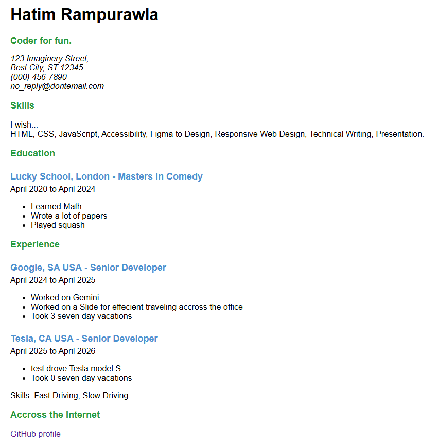
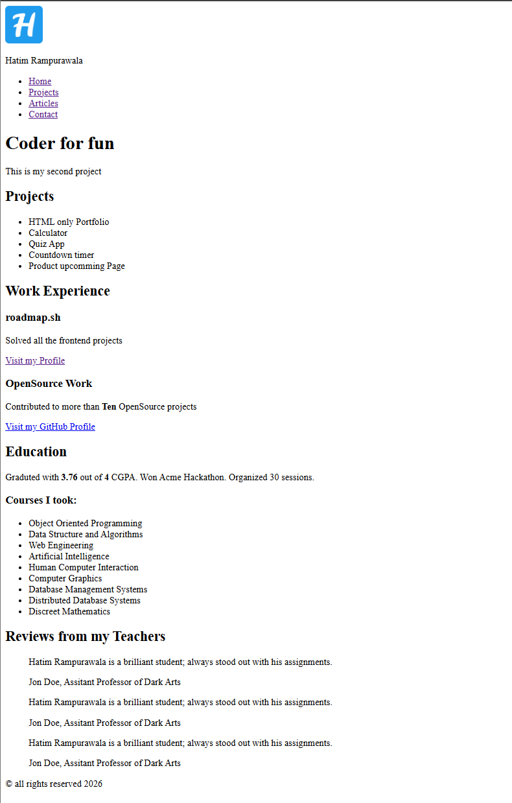

# 🗺️ Roadmap.sh Projects Showcase

Welcome to my repository showcasing projects built as part of the learning paths on [roadmap.sh](https://roadmap.sh/). This repository tracks my progress, code, and live demos for each challenge.

---

<div align="center">

[](https://roadmap.sh)
[](https://roadmap.sh/frontend)
[](https://roadmap.sh/frontend/projects)

</div>

---

## 📂 Table of Contents

- [🎨 Frontend Projects](#-frontend-projects)
- [⚙️ Backend & Other Paths (Future)](#️-backend--other-paths-future)
- [🛠️ How to Add a New Project](#-how-to-add-a-new-project)

---

## 🎨 Frontend Projects

This section contains projects built following the [Roadmap.sh Frontend Developer Path](https://roadmap.sh/frontend/projects).

<table width="100%">
  <!-- Row 1 -->
  <tr>
    <!-- Project 1: Single-Page CV -->
    <td width="50%" align="center" valign="top">
      <br>
      <a href="./Frontend-Projects/01-single-page-cv/">
        
      </a>
      <h3>📄 Single-Page CV</h3>
      <p align="left">A responsive, clean, single-page interactive CV built with semantic HTML and custom CSS styles.</p>
      <p>
        <a href="https://htmlpreview.github.io/?https://github.com/hatimrampurawala-bit/roadmap.sh-projects/blob/master/Frontend-Projects/01-single-page-cv/index.html">
          
        </a>
        &nbsp;
        <a href="https://roadmap.sh/projects/single-page-cv">
          
        </a>
      </p>
    </td>
    <!-- Project 2: Basic HTML Website -->
    <td width="50%" align="center" valign="top">
      <br>
      <a href="./Frontend-Projects/02-basic-html-website/">
        
      </a>
      <h3> 🌐 Basic HTML Website</h3>
      <p align="left">A multi-page HTML website focusing on navigation, semantic structure, and content layout.</p>
      <p>
        <a href="https://htmlpreview.github.io/?https://github.com/hatimrampurawala-bit/roadmap.sh-projects/blob/master/Frontend-Projects/02-basic-html-website/index.html">
          
        </a>
        &nbsp;
        <a href="https://roadmap.sh/projects/basic-html-website">
          
        </a>
      </p>
    </td>
  </tr>
</table>


<!--## ⚙️ Backend & Other Paths (Future)

> [!NOTE]  
> Projects for Backend, DevOps, or Fullstack paths will be cataloged here once initiated.

---

## 🛠️ How to Add a New Project

Adding a new project is extremely easy! Follow these steps:

### 1. Structure Your Directory

Create your project folder inside the category directory (e.g., `Frontend-Projects/`):

```text
Frontend-Projects/
├── 01-single-page-cv/
└── 02-basic-html-website/   <-- Your new project folder
    ├── index.html
    └── styles.css
```

### 2. Save a Preview Image

Take a screenshot of your completed project and save it to the global assets directory:

- Path: `assets/images/your-project-name.png` (or `.jpg`, `.svg`)

### 3. Update the Grid in README.md

Locate the `<table width="100%">` element in the respective section of `README.md` and insert/replace a cell (`<td>`) with the template below.

#### Cell Template:

```html
<td width="50%" align="center" valign="top">
  <br />
  <a href="./Frontend-Projects/XX-your-project-folder/">
    
  </a>
  <h3>🚀 Project Name</h3>
  <p align="left">
    A brief description of what the project is and what you learned.
  </p>
  <p>
    <a href="./Frontend-Projects/XX-your-project-folder/">
      
    </a>
    &nbsp;
    <a href="https://roadmap.sh/projects/your-challenge-id">
      
    </a>
  </p>
</td>
```

> [!TIP]  
> **Row Management**:
>
> - If a row (`<tr>`) has only one project, add the template as the second `<td>` inside that same row.
> - If the row is already full (has two projects), create a new row `<tr> ... </tr>` underneath it and paste the template inside.-->
